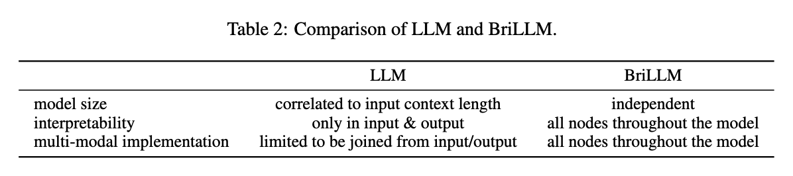

# BriLLM: Brain-inspired Large Language Model

We release BriLLM-Chinese and BriLLM-English.

Our paper: https://arxiv.org/pdf/2503.11299

Our huggingface: https://huggingface.co/BriLLM/BriLLM0.5


## Overview
This work introduces the first brain-inspired large language model (BriLLM). This is a non-Transformer, non-GPT, non-traditional machine learning input-output controlled generative language model. The model is based on the Signal Fully-connected flowing (SiFu) definition on the directed graph in terms of the neural network, and has the interpretability of all nodes on the graph of the whole model, instead of the traditional machine learning model that only has limited interpretability at the input and output ends. 


## SiFU Mechanism

> As shown in Figure 1, SiFu model is a graph composed of multiple nodes, which are sparsely activated and utilize tensors to transmit a nominal signal.
Each node (ideally, a layer of neurons) represents a certain concept or word, e.g., a noun, a verb, etc.
Each edge models the relationship between every node pair.
The signal is transmitted by the magnitude of the energy. The energy will be strengthened, i.e., maximized, if it is in the right route. Or, at least, the right path always keeps the maximal energy for the transmitted signal.
Each node is sequentially activated in terms of the maximized energy.
Route or path is determined in a competitive way, i.e., the next node will be activated only if the energy can be maximally delivered in this node.


## Architecture

> As shown in Figure 2, BriLLM implements SiFu neural network for language modeling. 
Each token in the vocabulary is modeled as a node, which is defined by a hidden layer of neurons in the neural network.


## Training Network

> To train a sample in BriLLM, every time we build an individual common neural network to perform the regular BP training. This network consists of two parts, in which the front part connects all input nodes (i.e., tokens), then it follows the rear parts which connect all possible paths in order. At last, a softmax layer collects all paths' energy tensors to indicate the right path with a 0-1 ground truth vector. We adopt a cross-entropy loss for training.


## Dataset
We use the subset from the Chinese version of Wikipedia, which contains over 100M Chinese characters. We truncate the long sentences into small sentences with a maximum length of 16.
We select a vocabulary of 4,000 tokens consisting of the most frequently used Chinese characters.


## Implementation Details.
BriLLM is implemented using PyTorch. 
It uses sinusoidal positional encoding, GeLU as the activation function, cross-entropy loss for next-token prediction, and an embedding size of $d_{model} = 32$. 
We used the AdamW optimizer with $\beta_1 = 0.9$, $\beta_2 = 0.999$ and $\epsilon = 10^{-8}$. 
The model size is about $512 + 4000 * 4000 * (32 * 32 + 32) \approx 16B$.
We trained our models on one machine with 8 NVIDIA A800 GPUs for 1.5k steps. 


## Complexity
$n$ is the sequence length, $v$ is the vocabulary size, and $d$ is the representation dimension. The computational complexity is $O(n \cdot v \cdot d^2)$.


## Case Study


## Comparison of LLM and BriLLM



## Installation
```bash
pip install torch
```


## Checkpoint
[BriLLM0.5](https://huggingface.co/BriLLM/BriLLM0.5)


## Train
### BriLLM-Chinese
```bash
bash run_zh.sh
```

### BriLLM-English
```bash
bash run_en.sh
```


## Inference
### BriLLM-Chinese
```python
import json
import torch
from model import BraLM, Vocab

with open("vocab_wiki_4k.json") as f:
     node_dict = json.load(f)
vocab = Vocab.from_node_dict(node_dict)

with open('word_frequency.json', 'r') as f:
    freq_dict = json.load(f)

zero_freq_edges = {}
for s in freq_dict:
    zero_freq_edges[s] = []
    for t in freq_dict[s]:
        if freq_dict[s][t] == 0:
            zero_freq_edges[s].append(t)

model = BraLM(hidden_size=32, zero_freq_edges=zero_freq_edges, vocab=vocab)
model.prepare_network(vocab)

state_dict = torch.load("model_zh.bin", weights_only=True)
model.load_state_dict(state_dict)
model.to_device("cuda:6")

head = "《罗马》描述了"
max_token = 32 - len(head)

start = [vocab((head[i]+ '->' +head[i+1])) for i in range(len(head)-1)]
ret = model.decode(start, vocab, max_token)
decode_tuple_list = [vocab.decode(p) for p in ret]
decode_sentence = decode_tuple_list[0][0] + "".join([p[-1] for p in decode_tuple_list])

print(decode_sentence)
```


### BriLLM-English
```python
import json
import torch
from model import BraLM, Vocab
from tokenizers import Tokenizer

bpe_tokenizer = Tokenizer.from_file("wiki_bpe_tokenizer_4000_bytelevel.json")

def decode_en_sentence(head, max_token=32, do_sample=False):
    bpe_tokens = bpe_tokenizer.encode(head).tokens
    if len(bpe_tokens) < 2:
        return head
    start = [vocab((bpe_tokens[i] + '->' + bpe_tokens[i+1])) for i in range(len(bpe_tokens)-1)]
    ret = model.decode(start, vocab, max_token, do_sample)
    decode_tuple_list = [vocab.decode(p).split('->') for p in ret]
    decode_sentence = decode_tuple_list[0][0] + "".join([p[-1] for p in decode_tuple_list])
    return decode_sentence


with open("./vocab_wiki_4k_en.json") as f:
     node_dict = json.load(f)
vocab = Vocab.from_node_dict(node_dict)

model = BraLM(hidden_size=32)
model.prepare_network(vocab)

state_dict = torch.load("model_en.bin", weights_only=True)
model.load_state_dict(state_dict)
model.to_device("cuda:6")

head = "In frogs, the hind legs are larger"
encoding = bpe_tokenizer.encode(head)
token_len = len(encoding.ids)
max_token = 32 - token_len
decode_sentence = decode_en_sentence(head, max_token).replace("Ġ", " ")

print(decode_sentence)
```